# Mermaid 图表测试集

本文件用于测试 `MarkdownViewer` + `MermaidBlock` 对各种 Mermaid 图表的渲染能力，覆盖方向控制、中文内容、复杂节点关系、主题适配等场景。

---

## 1. 流程图（Flowchart）— 基础与方向

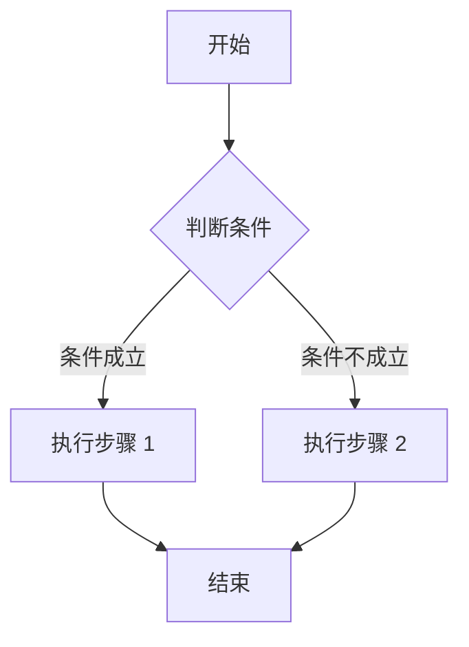
```mermaid
flowchart TD
    A[开始] --> B{判断条件}
    B -->|条件成立| C[执行步骤 1]
    B -->|条件不成立| D[执行步骤 2]
    C --> E[结束]
    D --> E
```

## 2. 流程图 — 复杂路径与子图

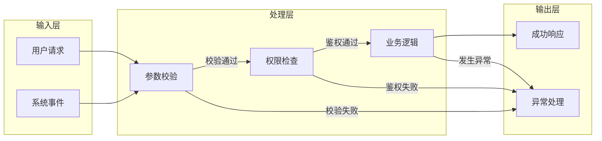
```mermaid
flowchart LR
    subgraph 输入层
        A1[用户请求]
        A2[系统事件]
    end

    subgraph 处理层
        B1[参数校验]
        B2[权限检查]
        B3[业务逻辑]
    end

    subgraph 输出层
        C1[成功响应]
        C2[异常处理]
    end

    A1 --> B1
    A2 --> B1
    B1 -->|校验通过| B2
    B1 -->|校验失败| C2
    B2 -->|鉴权通过| B3
    B2 -->|鉴权失败| C2
    B3 --> C1
    B3 -->|发生异常| C2
```

## 3. 流程图 — 多方向与样式

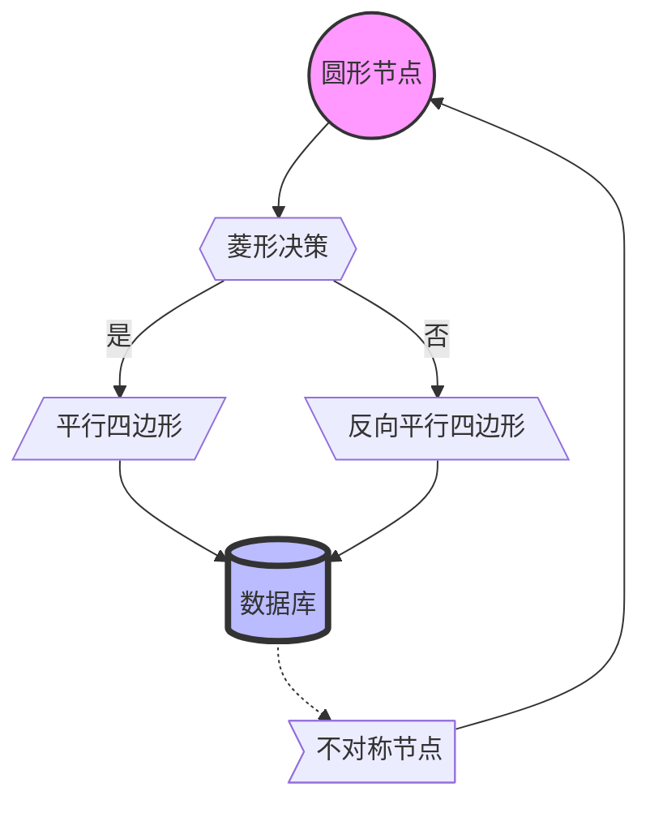
```mermaid
flowchart TB
    A((圆形节点))
    B{{菱形决策}}
    C[/平行四边形/]
    D[\反向平行四边形\]
    E[(数据库)]
    F>不对称节点]

    A --> B
    B -->|是| C
    B -->|否| D
    C --> E
    D --> E
    E -.-> F
    F --> A

    style A fill:#f9f,stroke:#333,stroke-width:2px
    style E fill:#bbf,stroke:#333,stroke-width:4px
```

## 4. 时序图（Sequence Diagram）— 基础交互

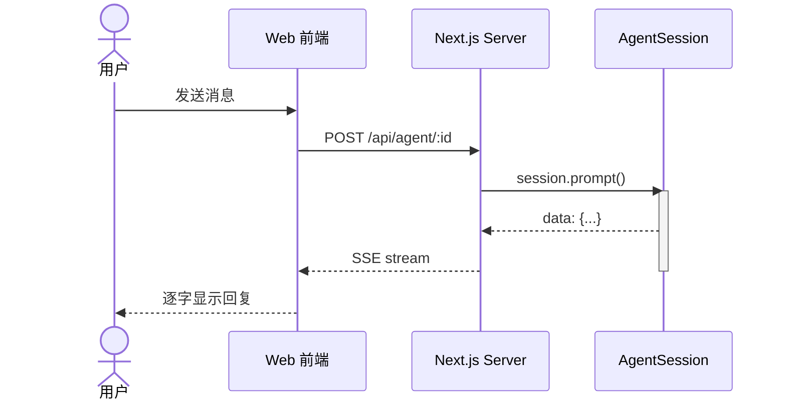
```mermaid
sequenceDiagram
    actor U as 用户
    participant W as Web 前端
    participant S as Next.js Server
    participant A as AgentSession

    U->>W: 发送消息
    W->>S: POST /api/agent/:id
    S->>A: session.prompt()
    activate A
    A-->>S: data: {...}
    S-->>W: SSE stream
    deactivate A
    W-->>U: 逐字显示回复
```

## 5. 时序图 — 循环、条件与注释

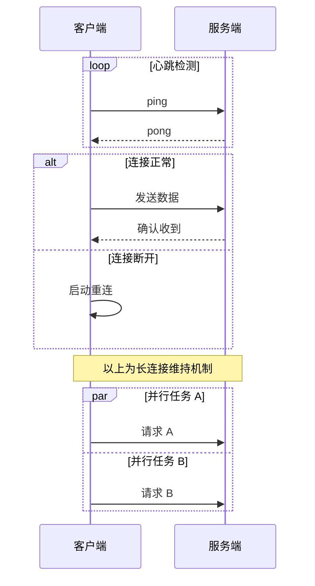
```mermaid
sequenceDiagram
    participant C as 客户端
    participant S as 服务端

    loop 心跳检测
        C->>S: ping
        S-->>C: pong
    end

    alt 连接正常
        C->>S: 发送数据
        S-->>C: 确认收到
    else 连接断开
        C->>C: 启动重连
    end

    Note over C,S: 以上为长连接维持机制

    par 并行任务 A
        C->>S: 请求 A
    and 并行任务 B
        C->>S: 请求 B
    end
```

## 6. 类图（Class Diagram）— 属性与方法

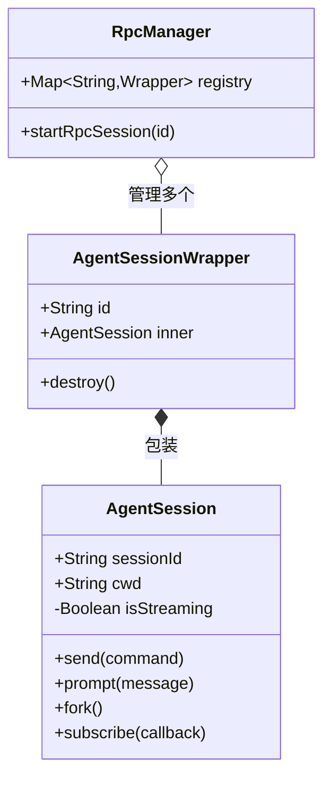
```mermaid
classDiagram
    class AgentSession {
        +String sessionId
        +String cwd
        -Boolean isStreaming
        +send(command)
        +prompt(message)
        +fork()
        +subscribe(callback)
    }

    class AgentSessionWrapper {
        +String id
        +AgentSession inner
        +destroy()
    }

    class RpcManager {
        +Map~String,Wrapper~ registry
        +startRpcSession(id)
    }

    AgentSessionWrapper *-- AgentSession : 包装
    RpcManager o-- AgentSessionWrapper : 管理多个
```

## 7. 类图 — 继承与接口

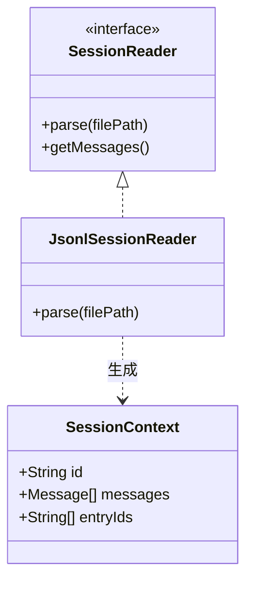
```mermaid
classDiagram
    direction TB

    class SessionReader {
        <<interface>>
        +parse(filePath)
        +getMessages()
    }

    class JsonlSessionReader {
        +parse(filePath)
    }

    class SessionContext {
        +String id
        +Message[] messages
        +String[] entryIds
    }

    SessionReader <|.. JsonlSessionReader
    JsonlSessionReader ..> SessionContext : 生成
```

## 8. 状态图（State Diagram）— 嵌套状态

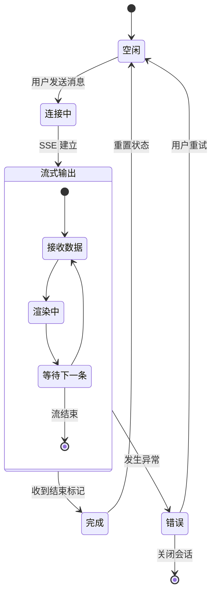
```mermaid
stateDiagram-v2
    [*] --> 空闲

    空闲 --> 连接中 : 用户发送消息
    连接中 --> 流式输出 : SSE 建立
    流式输出 --> 完成 : 收到结束标记
    流式输出 --> 错误 : 发生异常
    完成 --> 空闲 : 重置状态
    错误 --> 空闲 : 用户重试
    错误 --> [*] : 关闭会话

    state 流式输出 {
        [*] --> 接收数据
        接收数据 --> 渲染中
        渲染中 --> 等待下一条
        等待下一条 --> 接收数据
        等待下一条 --> [*] : 流结束
    }
```

## 9. ER 图（Entity Relationship Diagram）

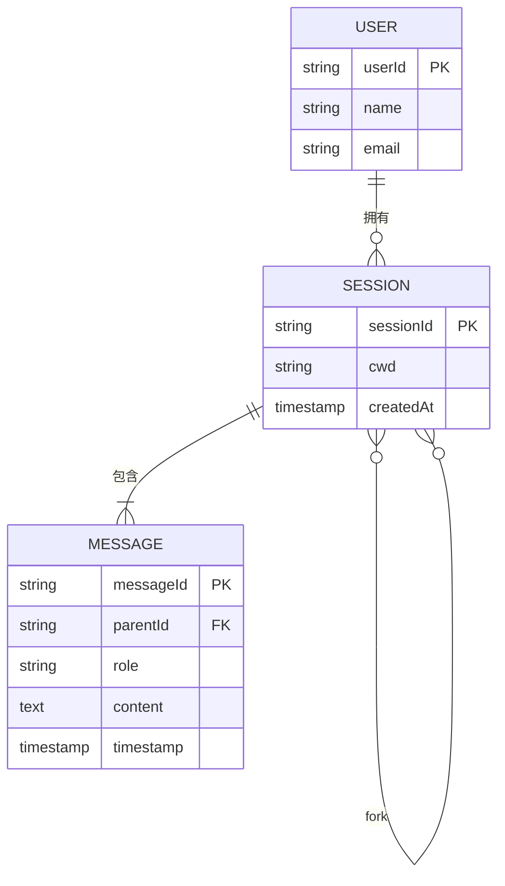
```mermaid
erDiagram
    USER ||--o{ SESSION : 拥有
    USER {
        string userId PK
        string name
        string email
    }

    SESSION ||--|{ MESSAGE : 包含
    SESSION {
        string sessionId PK
        string cwd
        timestamp createdAt
    }

    MESSAGE {
        string messageId PK
        string parentId FK
        string role
        text content
        timestamp timestamp
    }

    SESSION }o--o{ SESSION : fork
```

## 10. 甘特图（Gantt Chart）

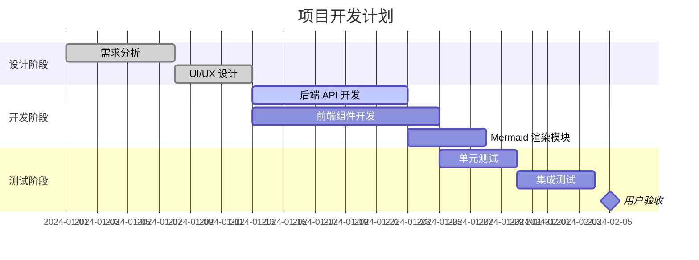
```mermaid
gantt
    title 项目开发计划
    dateFormat  YYYY-MM-DD
    section 设计阶段
    需求分析           :done, a1, 2024-01-01, 7d
    UI/UX 设计         :done, a2, after a1, 5d
    section 开发阶段
    后端 API 开发      :active, b1, after a2, 10d
    前端组件开发       :b2, after a2, 12d
    Mermaid 渲染模块   :b3, after b1, 5d
    section 测试阶段
    单元测试           :c1, after b2, 5d
    集成测试           :c2, after c1, 5d
    用户验收           :milestone, c3, after c2, 2d
```

## 11. 饼图（Pie Chart）

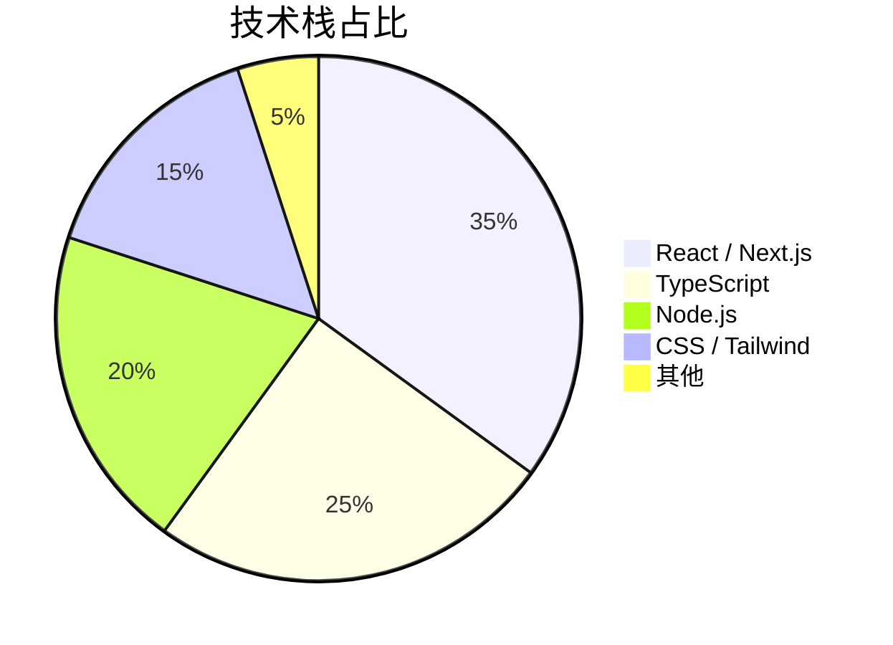
```mermaid
pie title 技术栈占比
    "React / Next.js" : 35
    "TypeScript" : 25
    "Node.js" : 20
    "CSS / Tailwind" : 15
    "其他" : 5
```

## 12. Git 图（Git Graph）

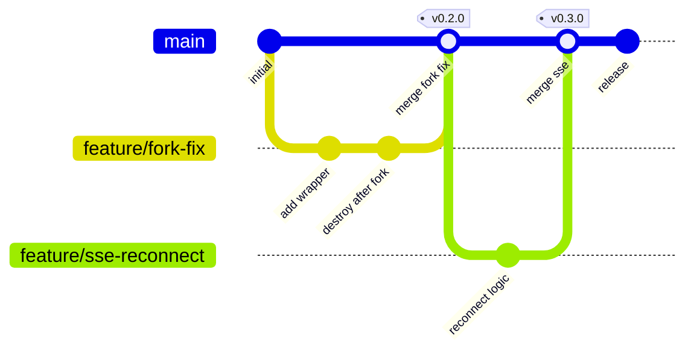
```mermaid
gitGraph
    commit id: "initial"
    branch feature/fork-fix
    checkout feature/fork-fix
    commit id: "add wrapper"
    commit id: "destroy after fork"
    checkout main
    merge feature/fork-fix id: "merge fork fix" tag: "v0.2.0"
    branch feature/sse-reconnect
    checkout feature/sse-reconnect
    commit id: "reconnect logic"
    checkout main
    merge feature/sse-reconnect id: "merge sse" tag: "v0.3.0"
    commit id: "release"
```

## 13. C4 上下文图（C4Context）

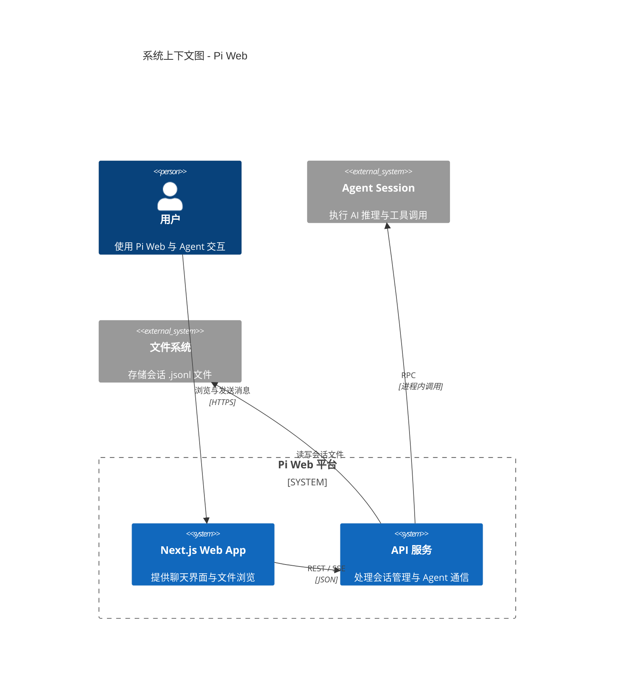
```mermaid
C4Context
    title 系统上下文图 - Pi Web

    Person(user, "用户", "使用 Pi Web 与 Agent 交互")
    System_Boundary(pi, "Pi Web 平台") {
        System(web, "Next.js Web App", "提供聊天界面与文件浏览")
        System(api, "API 服务", "处理会话管理与 Agent 通信")
    }
    System_Ext(agent, "Agent Session", "执行 AI 推理与工具调用")
    System_Ext(fs, "文件系统", "存储会话 .jsonl 文件")

    Rel(user, web, "浏览与发送消息", "HTTPS")
    Rel(web, api, "REST / SSE", "JSON")
    Rel(api, agent, "RPC", "进程内调用")
    Rel(api, fs, "读写会话文件")
```

## 14. C4 容器图（C4Container）

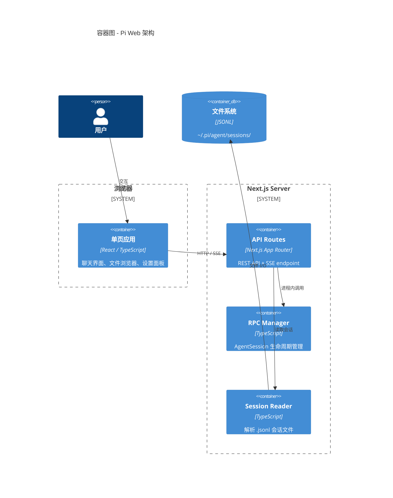
```mermaid
C4Container
    title 容器图 - Pi Web 架构

    Person(user, "用户")
    System_Boundary(browser, "浏览器") {
        Container(spa, "单页应用", "React / TypeScript", "聊天界面、文件浏览器、设置面板")
    }

    System_Boundary(server, "Next.js Server") {
        Container(api_routes, "API Routes", "Next.js App Router", "REST API + SSE endpoint")
        Container(rpc, "RPC Manager", "TypeScript", "AgentSession 生命周期管理")
        Container(reader, "Session Reader", "TypeScript", "解析 .jsonl 会话文件")
    }

    ContainerDb(fs, "文件系统", "JSONL", "~/.pi/agent/sessions/")

    Rel(user, spa, "交互", "UI")
    Rel(spa, api_routes, "HTTP / SSE")
    Rel(api_routes, rpc, "进程内调用")
    Rel(api_routes, reader, "读取会话")
    Rel(reader, fs, "文件 I/O")
```

## 15. 思维导图（Mindmap）

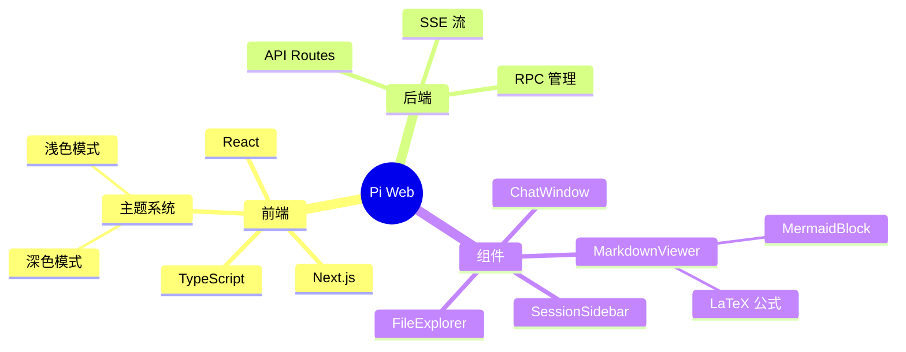
```mermaid
mindmap
  root((Pi Web))
    前端
      React
      Next.js
      TypeScript
      主题系统
        深色模式
        浅色模式
    后端
      API Routes
      SSE 流
      RPC 管理
    组件
      ChatWindow
      SessionSidebar
      MarkdownViewer
        MermaidBlock
        LaTeX 公式
      FileExplorer
```

## 16. 时间线（Timeline）

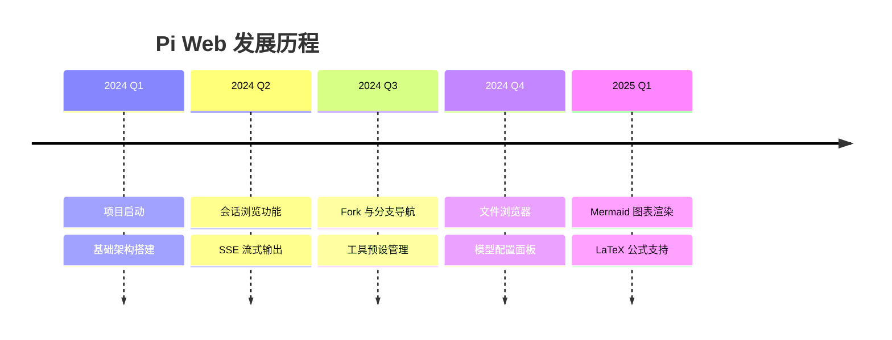
```mermaid
timeline
    title Pi Web 发展历程
    2024 Q1 : 项目启动
            : 基础架构搭建
    2024 Q2 : 会话浏览功能
            : SSE 流式输出
    2024 Q3 : Fork 与分支导航
            : 工具预设管理
    2024 Q4 : 文件浏览器
            : 模型配置面板
    2025 Q1 : Mermaid 图表渲染
            : LaTeX 公式支持
```

## 17. 用户旅程图（User Journey）

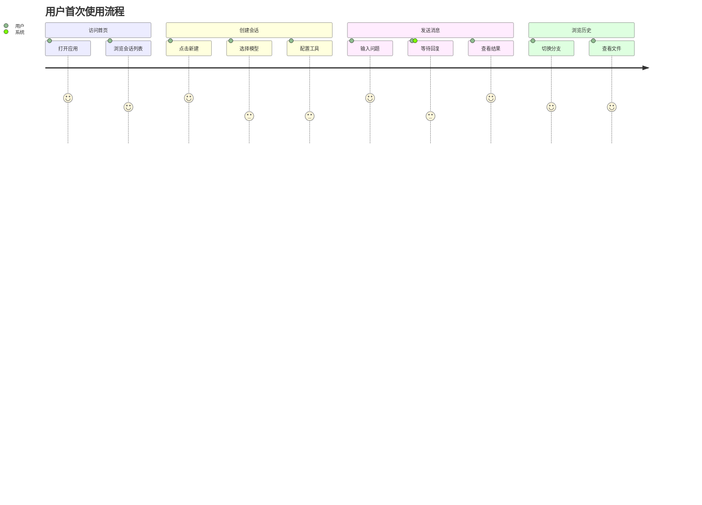
```mermaid
journey
    title 用户首次使用流程
    section 访问首页
      打开应用: 5: 用户
      浏览会话列表: 4: 用户
    section 创建会话
      点击新建: 5: 用户
      选择模型: 3: 用户
      配置工具: 3: 用户
    section 发送消息
      输入问题: 5: 用户
      等待回复: 3: 用户, 系统
      查看结果: 5: 用户
    section 浏览历史
      切换分支: 4: 用户
      查看文件: 4: 用户
```

## 18. 需求图（Requirement Diagram）

```mermaid
requirementDiagram
    requirement 功能需求 {
        id: FR001
        text: 支持 Mermaid 图表渲染
        risk: low
        verifymethod: test
    }

    requirement 性能需求 {
        id: PR001
        text: 首次渲染时间不超过 500ms
        risk: medium
        verifymethod: demonstration
    }

    functionalRequirement 主题适配 {
        id: FR002
        text: 图表支持深色与浅色主题切换
        risk: low
        verifymethod: inspection
    }

    FR001 <- derives - PR001
    FR001 <- contains - FR002
```

## 19. 网络图（Network / Graph）使用 flowchart 模拟

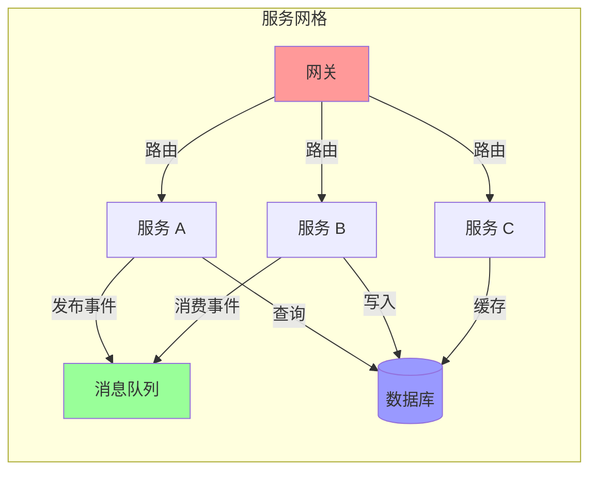
```mermaid
flowchart LR
    subgraph 服务网格
        A[网关]
        B[服务 A]
        C[服务 B]
        D[服务 C]
        E[消息队列]
        F[(数据库)]
    end

    A -->|路由| B
    A -->|路由| C
    A -->|路由| D
    B -->|发布事件| E
    C -->|消费事件| E
    B -->|查询| F
    C -->|写入| F
    D -->|缓存| F

    style A fill:#ff9999
    style E fill:#99ff99
    style F fill:#9999ff
```

## 20. 桑基图风格 — 使用 graph 语法

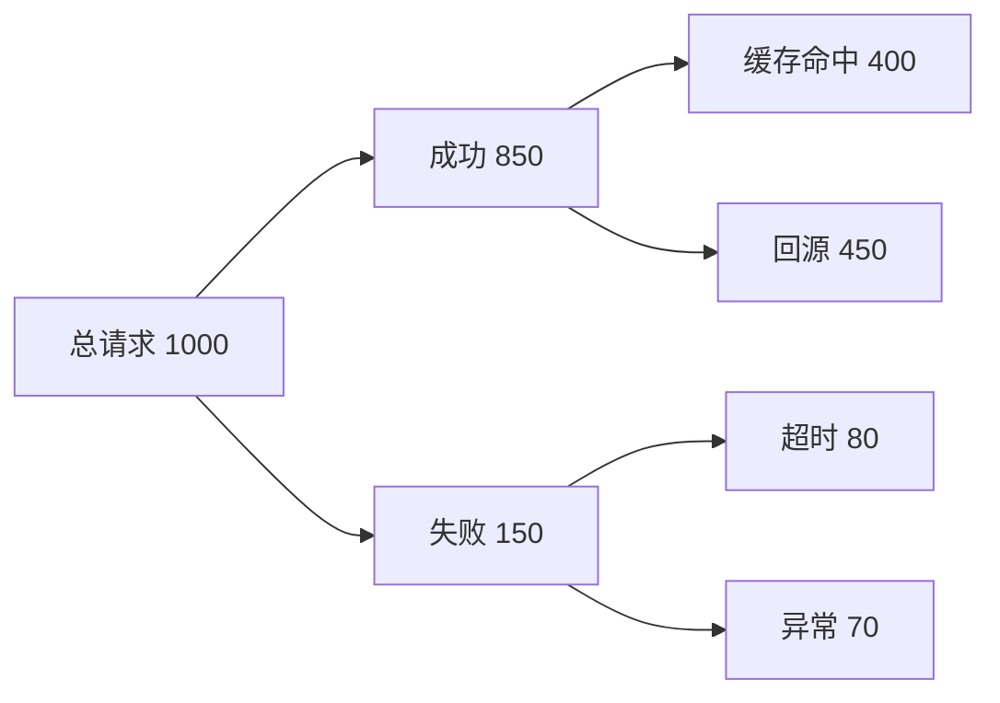
```mermaid
graph LR
    A[总请求 1000] --> B[成功 850]
    A --> C[失败 150]
    B --> D[缓存命中 400]
    B --> E[回源 450]
    C --> F[超时 80]
    C --> G[异常 70]
```

## 21. 复杂的类继承体系

```mermaid
classDiagram
    Component <|-- PureComponent
    Component <|-- MarkdownViewer
    Component <|-- MermaidBlock
    Component <|-- ChatWindow

    class Component {
        +props
        +state
        +render()
        +setState()
    }

    class PureComponent {
        +shouldComponentUpdate()
    }

    class MarkdownViewer {
        +String content
        +String className
        +render()
    }

    class MermaidBlock {
        +String code
        +Boolean isDark
        -String svg
        -String error
        +render()
    }

    MarkdownViewer ..> MermaidBlock : 渲染 mermaid 代码块
```

## 22. 多子图与跨子图连接

```mermaid
flowchart TB
    subgraph 客户端
        C1[输入框]
        C2[消息列表]
        C3[状态栏]
    end

    subgraph 服务端
        S1[API Route]
        S2[Session Wrapper]
        S3[Agent Core]
    end

    subgraph 存储层
        DB1[会话文件]
        DB2[配置 JSON]
    end

    C1 -->|POST| S1
    C2 -->|SSE| S1
    S1 --> S2
    S2 --> S3
    S2 --> DB1
    S1 --> DB2
    S3 -->|流式事件| S2
    S2 -->|SSE 推送| C3
```

## 23. 带注解的时序图 — 复杂业务逻辑

```mermaid
sequenceDiagram
    autonumber
    participant C as Client
    participant G as Gateway
    participant A as Auth
    participant S as Service
    participant D as DB

    C->>G: POST /api/data
    Note right of C: 携带 JWT Token

    G->>A: 验证 Token
    alt Token 有效
        A-->>G: 用户信息
        G->>S: 转发请求
        S->>D: 查询数据
        D-->>S: 返回结果
        S-->>G: 业务数据
        G-->>C: 200 OK
    else Token 过期
        A-->>G: 401 Unauthorized
        G-->>C: 401 + 刷新提示
    else Token 无效
        A-->>G: 403 Forbidden
        G-->>C: 403 拒绝访问
    end

    Note over C,D: 完整认证授权流程
```

## 24. 复杂甘特图 — 多项目依赖

```mermaid
gantt
    title 多团队协作开发计划
    dateFormat HH-mm
    axisFormat %H:%M

    section 前端团队
    搭建项目      :a1, 09-00, 2h
    组件开发      :a2, after a1, 4h
    联调测试      :a3, after a2, 2h

    section 后端团队
    设计 API      :b1, 09-00, 2h
    实现接口      :b2, after b1, 3h
    数据迁移      :b3, after b2, 2h

    section 测试团队
    用例编写      :c1, 10-00, 3h
    集成测试      :c2, after a3, 2h
    回归测试      :c3, after c2, 2h

    a2 --> b3
    b3 --> c2
```

## 25. 包含中文与特殊字符的类图

```mermaid
classDiagram
    class 用户控制器 {
        +获取用户列表()
        +创建用户()
        +更新用户信息()
        +删除用户()
    }

    class 用户服务 {
        +验证邮箱(String 邮箱)
        +加密密码(String 密码) String
        -日志记录(String 消息)
    }

    class 用户实体 {
        +Long ID
        +String 用户名
        +String 邮箱
        +DateTime 创建时间
    }

    用户控制器 --> 用户服务 : 调用
    用户服务 --> 用户实体 : 操作
```

## 26. 状态图 — 并发状态（parallel）

```mermaid
stateDiagram-v2
    [*] --> 活跃

    state 活跃 {
        [*] --> 处理中
        处理中 --> 等待输入
        等待输入 --> 处理中
        --
        [*] --> 后台任务
        后台任务 --> 完成
        完成 --> [*]
    }

    活跃 --> 挂起 : 用户离开
    挂起 --> 活跃 : 用户返回
    活跃 --> [*] : 会话关闭
```

## 27. 错误与边界测试 — 错误语法（应显示错误信息）

```mermaid
flowchart TD
    A[正常节点] --> B[正常节点]
```

> 上面的图表语法是正确的。以下包含一个**故意错误**的 mermaid 代码块，用于测试 `MermaidBlock` 的错误提示渲染：

```mermaid
flowchart TD
    A[正常] --> B{决策}
    B -->|是| C[结果1]
    B -- 这行语法错误因为缺少目标节点
```

## 28. 空代码块测试

```mermaid
```

> 上面的代码块内容为空，应优雅处理（不崩溃）。

---

## 测试说明

| 编号 | 图表类型 | 测试重点 |
|------|----------|----------|
| 1-3 | Flowchart | 方向控制、子图、样式、多形状 |
| 4-5, 23 | Sequence | 基础交互、循环/条件/并行、autonumber |
| 6-7, 21, 25 | Class | 属性方法、继承接口、复杂体系、中文支持 |
| 8, 26 | State | 嵌套状态、并发 parallel |
| 9 | ER | 实体关系、外键关联 |
| 10, 24 | Gantt | 日期/时间格式、多 section、依赖线 |
| 11 | Pie | 百分比显示 |
| 12 | Git Graph | 分支、合并、tag |
| 13-14 | C4 | 上下文与容器图 |
| 15 | Mindmap | 层级思维导图 |
| 16 | Timeline | 时间线事件 |
| 17 | Journey | 用户旅程评分 |
| 18 | Requirement | 需求追溯关系 |
| 19-20 | 网络/桑基 | flowchart 模拟复杂网络 |
| 22 | 多子图 | 跨子图连接 |
| 27 | 错误处理 | 语法错误的降级展示 |
| 28 | 空内容 | 边界情况 |
